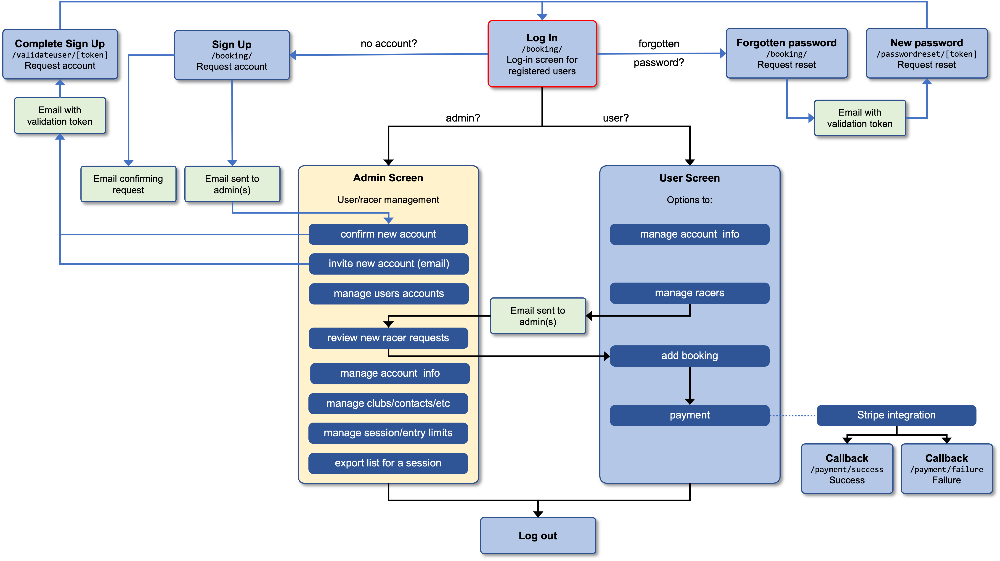
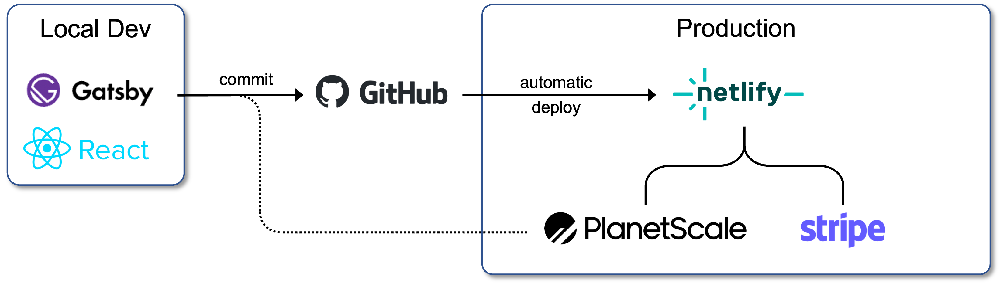

# LSERSA website

[](https://app.netlify.com/sites/lsersa/deploys)

2023 re-build of the LSERSA website using [Gatsby](https://www.gatsbyjs.com/),
[PlanetScale](https://planetscale.com/) and [Netlify](https://www.netlify.com/), with
[Stripe](https://stripe.com/en-gb) integration for payments.

## Index
**[Rationale](#rationale)**

**[Deployment](#deployment)**

**[Race Results](#race-results)**

**[Sponsors](#sponsors)**

**[The Region](#the-region)**
* [Clubs](#clubs)
* [Slopes](#slopes)

**[Booking System](#booking-system)**
* [Structure Flow](#structure-flow)
* [Database](#database)
* [API Endpoints](#api-endpoints)

The general flow of the booking system is:



## Rationale

Using Gatsby allows for a data-driven approach to generating the site (particularly  for the
`/races/` and `/minutes/` elements, which otherwise are proven to be quite intensive to maintain)
and also provides React and lambda functions to run the booking system.

## Deployment

The replacement site is deployed onto Netlify (using GitHub integration); the `lsersa.org` domain,
which is provided through [EasySpace](https://www.easyspace.com/), is then set to point to the
Netlify app 'behind the scenes'.

*This is the approach taken for the Bowles website re-build from 2016, which worked well.*



[⥣ back to index](#index)

## Race Results

The race results pages are mostly driven by structured data stored in the `races.yaml` (for the
calendar/results) and `specials.yaml` (for LSERSA end-of-year special cups) files:

```
src
|- data
   |- races.yaml
   |- specials.yaml
```

The general structure of the `races.yaml` data is as follows (there are also some end-of-year values
for LSERSA overall winners, look at previous years for examples):

```yaml
-   year:           // year, eg 2023
    events:         
    -   series:     // series name, eg LSERSA Summer Series
        races:        
        -   name:   // name of fist race, eg Race 1
            venue:  // venue eg Chatham
            date:   // date, full text, eg Saturday 27th May
            url:    // full http(s) url, leave blank if no link
            status: // Results if complete, Entries otherwise

        -  name:    // name of second race
                    // etc etc

    -   series:     // name of second series
        races:
        -   name:   // name of first race of second series
                    // etc etc
```

The structure of the `specials.yaml` file is much simpler

```yaml
-   year:         // year, eg 2023
    items:         
    -   name:     // name of the cup
        winner:   // name of the winner
    -   name:     // etc etc
        winner:
```

The data from these two files **generates** all 'archive results' pages and feeds the calendar
data in the 'current' race page; the most recent year should always be at the **top** of the file;
the most recent year in the `races.yaml` file is assumed to be "this year".

Updates generally:
* at the start of the year (and once sufficient dates are known) add a new year to `races.yaml` with
  race series, dates, venues; leave the `url` blank; if Entries are available make the `status`
  "Entries", otherwise "Entries tbc"
* update as links to Ski Results, GBSki etc become available
* once a race is complete, change the `status` to "Results"
* at the end of season, add LSERSA special cups info to the `specials.yaml` file

[⥣ back to index](#index)

## Sponsors

Sponsor information is stored in the `sponsors.yaml` data file:

```
src
|- data
   |- sponsors.yaml
```

The structure for each sponsor is:

```yaml
-   name:   // sponsors name
    url:    // url for sponsor's website
    img:    // image in 400x300 ratio, in scr/images/sponsors *
    target: // recommend underscore and sponsor name, no spaces
    copy:   // sponsor copy in html formatting

* img path in the file should be sponsors/<sponsor_name>.png (or jpeg)
```

This data is used (a) to populate the `sponsors` page, (b) to populate the sponsors carousel that
sits alongside "hero" images, and (c) to populate the sponsors images at the bottom of the homepage.

As the number of sponsors changes, the styling of the sponsor logos at the bottom of the homepage
may need updating; at the time of writing it is set up for eight logos in one row (reducing to four
logos per row on devices with screen width less than 900px). This is determined by the styling
of the `.sponsor-logo-grid` element **in the `_homepage.scss` file** (change the 
`grid-template-columns: repeat(8, 1fr);` value).

As new sponsors are added (and old removed), the following changes are required:
* change the content of the `sponsors.yaml` file (deleting and adding as appropriate)
* for new sponsors, a logo is required - this should be saved in the `src/images/sponsors` 
  folder; have a transparent background (`png` recommended); be in a 4:3 ratio, ideally 400x300
* add the logo to the 'sponsor banners' in `static/images` (there are two, one post-fixed `_1200`
  which should be 1200px wide, and the other without a post-fix which should be 800px wide; height
  "doesn't matter")
* if the number of sponsors changes, change the `grid-template-columns` value in
  `src/style/_homepage.scss` (for `.sponsor-grid-logo`)
  
[⥣ back to index](#index)

## The Region

### Clubs

As with most other elements, clubs info is stored in a YAML file - in this case, `src/data/clubs.yaml`.

The structure for the data is

```yaml
-   name:   // club name
    url:    // url for the club's website (or facebook page)
    img:    // image in 400x400 ratio, in scr/images/clubs *
    target: // recommend underscore and club name, no spaces
    copy:   // club copy in html formatting

* img path in the file should be clubs/<sponsor_name>.png (or jpeg)
```

Logos are 4:3 ratio (preferably 400x300 file size) with a transparent background (so ideally PNG).

All clubs officially affiliated with LSERSA (as notified by SSE) are listed, as well as
DSUK which has two local groups. This needs to be reviewed annually to ensure that any new
affiliates are picked up (and potentially remove any clubs that are no longer affiliated).

### Slopes

Data for the slopes is held in **two** files; the main one is another YAML file at
`src/data/slopes.yaml` with the following structure:

```yaml
-   name:      // slope/centre name
    url:       // url for the slope's website
    map_url :  // url for a Google maps search of the centre name at 2km scale
    img:       // image in 400x200 ratio, in scr/images/slopes *
    target:    // recommend underscore and slope name, no spaces
    copy:      // club copy in html formatting

* img path in the file should be slopes/<sponsor_name>.png (or jpeg)
```
**In addition** there is also a second file with JSON data at `src/lib/slope-data.js`. This
repeats the `name`, `url`, `map-url` and `target` fields, whilst also adding latitude and
longitude values (and is used by the API function `get-slopes` to determine distance from the
given postcode).

*The map images are either 2km or 5km scale screenshots taken from Google Maps and cropped
(**not** resized) to suit the 400x200 requirement; use appropriate scale and aim to have the
pin "somewhat central" so that if will still be in the image on smaller screens.*

[⥣ back to index](#index)

## Booking System

### Structure Flow

The general flow of the booking system is:


### Database

The backend for the booking system is a MySQL database on PlanetScale, accessed by API routes on
the website (provided as Gatsby functions). The database structure is:


[⥣ back to index](#index)

### API Endpoints

| Route          | Method | Comment
| ---            | :---:  |   ---
| `api/admin/`   |        |
| `.../admin-new-account` | `POST` | Called from admin pane to verify account 
| `.../clubs`    | `GET`  | Gets all rows from the `clubs` table
| `.../clubs`    | `POST` | Adds a new row to the `clubs` table
| `.../clubs`    | `PUT`  | Updates a row in the `clubs` table
| `.../clubs`    |`DELETE`| Deletes a row from the `clubs` table
| `.../request-count` | `GET` | Returns counts of unvalidated users and racers
| `.../requests` | `GET`  | Returns arrays of unvalidated users and racers
| `.../requests` | `POST` | Validates a user or racer request
| `.../requests` |`DELETE`| Rejects and deletes a user or racer request
| `api/get-slopes` |      |
| `...[postcode]` | `GET` | Returns two slopes nearest the postcode
| `api/user/`    |        |
| `.../login`    | `POST` | Check password, set cookie, login
| `.../logout`   | `POST` | Expires cookie, logout
| `.../new-account-complete` | `POST` | Complete account sign-up
| `.../.../[token]` |`GET`| Validates the token
| `.../new-account-request` | `POST` | Save user, send request to admin<sup>1</sup>|
| `.../password-reset-request` | `POST` | Insert token, send reset email
| `.../racers`   | `POST` | Inserts a new racer
| `.../racers`   | `PUT`  | Updates an existing racer
| `.../.../[user_id]` |`GET`| Gets racers associated with the account
| `.../reset-password-complete` | `POST` | Resets password
| `.../.../[token]` |`GET`| Validates the token
| `.../update-user-details` | `POST` | Update user's details
| `api/poll-jwt` | `GET`  | Validates there is a JWT saved and valid

**Footnotes**
1. If there are no users with admin role, the user will be assigned admin and auto-validated

[⥣ back to index](#index)
